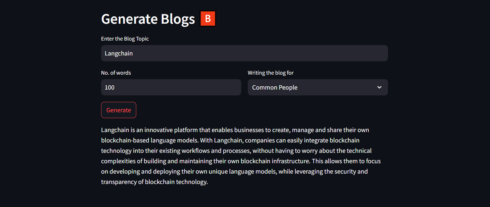

# Blog Generator

This application generates a blog based on the specifications provided by the user. It takes the blog topic, word limit and type of blog required (one out of common people, researchers and data scientists) and returns a customized write-up.

## Tools and Frameworks

The application uses Streamlit for the UI and Llama2 as the LLM. 
